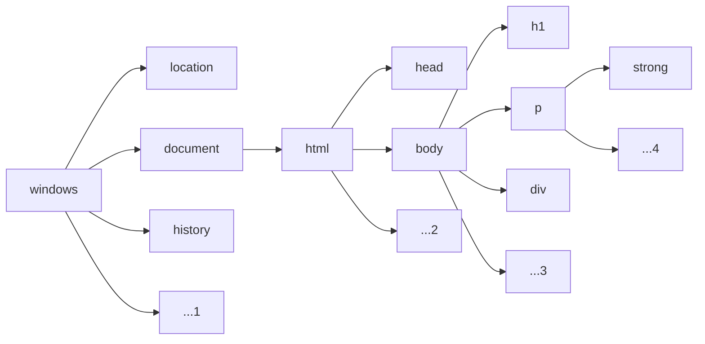

# Notas Sobre Java Script
**Por Raimundo Nonato Launé Macêdo**

O que encontraremos aqui são pequenas notas sobre um estudo que iniciamos em outubro de 2023 sobre a linguagem JavaScript. Portanto o texto não está completo e será atualizado à medida que os estudos avançam. Espero que o que aqui anotei sirva de ajuda ao mesmo tempo em que sugestões e aclareamentos possam ser adicionados ao que percebemos com a máscara de nossa incapacidade.

## 1. Variáveis

### 1.1. Number

```js
var ano = 1961  // Inteiras (int)
var peso = 76.5 // Ponto flutuante (float)
```

### 1.2. Cadeias de caracteres (string)

    var nome = 'Meu nome'
    var celular "... este é o meu número"
    var idade = `62 anos é minha idade`

### 1.3. Boolean

    true
    false


## 2. Conversão de Tipos

### 2.1. Texto para número

```js
var sf = '23.5'
var si = '55'
var b = Number.parseInt(sf)   // b = 23
var b = parseInt(sf)          // b = 23
var c = Number.parseFloat(sf) // c = 23.5
var c = parseFloat(sf)        // c = 23.5
var c = Number(sf)            // c = 23.5
var d = Number(si)            // d = 55
```

### 2.2. Número para texto

```js
var n1 = 23.4       // n1 = 23.4
var s1 = String(n1) // s1 = '23.4'
```

### 2.3. Substituição com place holder ${} e ``

```js
var nome = 'Launé'
var idade = 62
var nota = 3.5
var texto = `O aluno ${nome}`, de ${idade} anos de idade, obteve nota ${nota}`
```

### 2.4. Formatos (algumas funções string)

```js
var s1 = "meu dicionário"
var s2 = s.toUpperCase() // converte tudo para maiúsculas
```

### 2.5. Fomatação de números

```js
var n1 = 14343.2
var n2 = n1.toFixed(2)                   // n2 = '14343.20'
var n3 = n1.toFixed(2).replace('.',',')  // n3 = '14343,20'
var n4 = n1.toLocaleString('pt-BR', {style: 'currency', currency: 'BRL'})
    // v4 = 'R$ 14.343,20'
    // poderíamos ter USD, EUR, ...
    // Nota: o valor a ser convertido deve ser um núnemo (n2, n3 são strings)
```

#### Exemplo - 2:

```html
<!DOCTYPE html>
<html lang="pt-br">
<head>
    <meta charset="UTF-8">
    <meta name="viewport" content="width=device-width, initial-scale=1.0">
    <title>Meu primeiro script</title>
    <style>
        body {
            background: #224903;
            color: #abf76e;
            font: normal 20pt arial;
        }
        h1 {
            color: #fbff09;
        }
    </style>
</head>
<body>
    <h1>Olá, Mundo!</h1>
    <p>Este é meu primeiro script</p>
    <script>
        var nome = window.prompt('Como é seu nome?')
        window.alert("É um grande prazer te conhecer, " + nome + '!')
        var ano = window.prompt('Em que ano tu nasceste? ')
        var ano = Number.parseInt(ano)
        var idade = 2023 - ano
        window.alert(`Hum, então tu tens ${idade} anos de idade!`)
    </script>
</body>
</html>
```


## 3. Operadores Aritméticos e de Atribuição - Aula 08

```js
+     <-- Adição
-     <-- Subtração
*     <-- Multiplicação
/     <-- Divisão
%     <-- Resto da divisão
**    <-- Potenciação
```

### 3.1. Precedência

```js
()            <-- primeira ordem
**            <-- segunda ordem
*, / ou %     <-- terceira ordem
+ ou -        <-- quarta ordem
```

### 3.2. Auto atribuição

```js
var n = 1
n += 1    // equivale a     n = n + 1
++n       // idem a priori
n++       // idem a posteriori
n += 3    // equivale a     n = n + 3
n -= 1    // equivale a     n = n - 1
--n       // idem a priori
n--       // idem a posteriori
n -= 2    // equivale a     n = n - 2
n *= 3    // equivale a     n = n * 3
n /= 5    // equivale a     n = n / 5
n %= 2    // equivale a     n = n % 2
n **= 3   // equivale a     n = n ** 3
```


## 4. Operadores Relacionais, Lógicos e Ternários - Aula 09

### 4.1. Operdores relacionais

```js
>     <-- maior que
<     <-- menor que
>=    <-- maior que ou igual a
<=    <-- menor que ou igual a
==    <-- igua
!=    <-- diferente
```

### 4.2. Operador de identidade

```js
===     <-- é idêntico a
!==     <-- não é idêntico a
```

#### Exemplos - 4.2:

```js
5 == 5       (true)
5 == '5'     (true)    // O JavaScript não analisa tipos no teste de igualdade,
5 === 5      (true)
5 === '5'    (false)   // mas sim no teste de identidade
5 != 5       (false)
5 != '5'     (false)
5 !== 5      (false)
5 !== '5'    (true)
```

### 4.3. Operadores lógicos

```js
!     <-- negação
&&    <-- conjunção
||    <-- disjunção
```

#### 4.3.1. Ordem de precedência dos testes

```js
(), **, (*, / ou %), (+ ou -)     <-- operadores aritméticos
<, >, <=, >=, !=, ===, !==        <-- operadores lógicos
!                                 <-- negação
&&                                <-- conjunção
||                                <-- disjunção
```

### 4.4. Operadores ternários

```js
?    <-- para verdadeiro
:    <-- para falso
Sintaxe: <teste> ? <ação se verdadeiro> : <ação se falso>
```

#### Exemplo - 4.4:

```js
var a = 2
var b = 3
var c = a < b ? 'a é menor do que b' : 'b não supera a'
    // resulta c = 'a é menor do que b'
```

#### Exemplo - 4:

```html
<!DOCTYPE html>
<html lang="pt-BR">
<head>
    <meta charset="UTF-8">
    <meta name="viewport" content="width=device-width, initial-scale=1.0">
    <title>Primeira aula sobre DOM</title>
    <style>
        body {
            background: #0c4441;
            color: #a1eeea;
            font: normal 12pt arial;
        }
    </style>
</head>
<body>
    <h1>Primeira aula sobre Documet Object Model - DOM </h1>
    <p>Aqui vai um resultado</p>
    <p>aprendendo a usar <strong>DOM</strong></p>
    <div class="entrada">Div com nome de classe</div>
    <div id="entrada">Div com identificador único</div>
    <script>
        var p1 = window.document.getElementsByTagName('p')[0] 
        window.document.write('No primeiro parágrafo está escrito: '+p1.innerText)
        var p2 = window.document.getElementsByTagName('p')[1]
        p2.style.color = 'white'
        // corpo = window.document.body
        // corpo.style.background = 'green'
        // corpo.style.color = 'purple'
        document.write('<p>Parágrafo 2 sem formato: ' + p2.innerText)
        document.write('<p>Parágrafo 2 com formato: ' + p2.innerHTML) 
        d1 = document.querySelector('div.entrada')
        d2 = document.querySelector('div#entrada')
        d1.style.background = 'green'
        d2.style.background = 'blue'
    </script>
</body>    
</html>
```


## 5. Estudos Sobre DOM - Aula 10

DOM é um acrônimo para Document Object Model. Alguns elementos do DOM são:


> Usei o [Mermaid](https://github.com/rlaunemacedo/estudos_js/blob/main/sobre_mermaid.md) para a construção deste diagrama.

### 5.1. Formas de acesso aos elementos

#### Por marca

```js
getElementsByTagName()
```

#### Por id

```js
getElementById()
```

#### Por nome

```js
getElementsByName()
```

#### Por classe

```js
getElementsByClassName()
```

#### Por Seletor (para os browsers mais novos)

```js
querySelector()
```

Neste caso, o argumento é uma string com:

- tag.class; ou
- tag#id

> Nota: Observe-se que quando tivermos o plural - ```Elements``` - na função, ao final, teremos que usar ```[]``` para terminarmos de caracterizar o elemento buscado. Por exemplo ```var dv1 = getElementsByName('div')['0']```, ```var dv2 = getElementsByName('div')['1'], ...```

#### Exemplos - 5.1:

##### Com o uso de nome da classe

```html
<div class='entrada'>...</div>
```

```html
<script>
    window.document.querySelector('div.entrada')
</script>
```

##### Ou com o uso de id

```html
<div id='entrada'>...</div>
```

```html
<script>
    window.document.querySelector('div#entrada')
</script>
```

#### Exemplo - 5.1:

```html
<!DOCTYPE html>
<html lang="pt-BR">
<head>
    <meta charset="UTF-8">
    <meta name="viewport" content="width=device-width, initial-scale=1.0">
    <title>Eventos DOM</title>
    <style>
        div#area {
            /* border-radius: 10px;               */
            border-radius: 10px 20px;
            /* border-radius: 10px 20px 30px;     */
            /* border-radius: 0px 10px 20px 30px; */
            border-width: 2px;
            border-style: solid;
              border-color: brown;
            font: normal 20pt arial;
            background: #fdb4b4;
            color: #4d0505;
            height: 200px;
            width: 200px;
            line-height: 200px;
            text-align: center;
        }
    </style>
</head>
<body>
    <div id="area" onclick="clicar()">
        Interagir
    </div>
    <script>
        var dv = window.document.getElementById('area')
        dv.addEventListener('mouseenter', entrou)
        dv.addEventListener('mouseout', saiu)

        function entrou(){
            dv.style.background = 'green'
        }

        function saiu(){
            dv.style.background = '#fdb4b4'
            dv.style.cursor = 'pointer'
        }

        function clicar(){
            var dt = dv.innerText
            var tx = dt == 'Interagir' ? 'Clicou' : 'Interagir'
            dv.innerText = tx
        }
    </script>
</body>
</html>
```

#### Exemplo - 5.2:

```html
<!DOCTYPE html>
<html lang="pt-BR">
<head>
    <meta charset="UTF-8">
    <meta name="viewport" content="width=device-width, initial-scale=1.0">
    <title>Somando valores</title>
    <style>
        body, input {
            font: normal 12pt arial
        }
        div {
            margin: 10px 0px;
            padding: 2px;
            border-style: solid;
            border-width: 1px;
        }
    </style>
</head>
<body>
    <input type="number" name="val1" id="v1"> +
    <input type="number" name="val2" id="v2">
    <input type="button" value="Somar" onclick="somar()">
    <div id="res">Resultado...</div>
    <script>
        function somar(){
            var valor1 = window.document.getElementById('v1').value
            var valor2 = window.document.querySelector('input#v2').value
            var vl1 = Number(valor1)
            var vl2 = Number(valor1)
            var s = vl1 + vl2
            document.getElementById('res').innerText = `Resultado: ${s}`
        }
    </script>
</body>
</html>
```

## 6. Eventos DOM - Aula 11

Para uma dada div:

```html
<div id='area'>Interagir</div>
```

podemos disparar os seguintes eventos com o movimento do mouse sobre esta div ([leia mais em](https://developer.mozilla.org/en-US/docs/Web/Events)):

- __mouseenter / mouseout__   
  quando o mouse entrar ou sair sobre a div 
- **mousemove**  
  quando o mouse se mover sobre a div
- **mousedown / mouseup**  
  quando o botão for pressionado ou liberado sobre a div 
- __mouseclick__  
  ao clicar sobre a div


## 7. Alteração de Fluxo - Aula 11/12

### 7.1. ```IF``` simples

```js
if (condição){
    ...
}
```

### 7.2. ```IF``` composto

```js
if (condição){
    ...
} else {
    ...
}
```

```js
if (condição 1){
    ...
} else if (condição 2){
    ...
} else if(condição 3){
    ...
} else {
    ...
}
```

#### Exemplo 7.1:

```js
var agora = new Date()
var hora = agora.getHours()
console.log(`São exatamente ${hora}`)
if (hora < 12) {
    console.log('Bom dia!')
} else if (hora < 18) {
    console.log('Boa tarde!')
} else {
    console.log('Boa noite!')
}
```

### 7.3. Uso de ```SWITCH```

```js
switch (expressão){
    case valor1:
        ...
        break
    case valor2:
        ...
        break
    default:  // opcional
        ...
        break // opcional
}
```

#### Exemplo - 7.2:

```js
switch (diaSemana){
    case 0:
        console.log('domingo')
        break
    case 1:
        console.log('segunda')
        break
    case 2:
        console.log('terça')
        break
    case 3:
        console.log('quarta')
        break
    case 4:
        console.log('quinta')
        break
    case 5:
        console.log('sexta')
        break
    default:
        console.log('sábado')
        break
}
```

#### Exemplo - 7.3:

```html
<!DOCTYPE html>
<html lang="pt-BR">
<head>
    <meta charset="UTF-8">
    <meta name="viewport" content="width=device-width, initial-scale=1.0">
    <title>Aula 11</title>
    <style>
        body, input{
            font: normal 12pt arial;
        }
    </style>
</head>
<body>
    <p>Vamos analisar sua velocidade... </p>
    <input type="number" name="veltxt" id="veltxt">
    <!--input type="button" value="Vejamos..." onclick="verifica()"-->
    <input id="but" type="button" value="Vejamos...">
    <div id="res"><p>Espere um pouco, vamos verificar sua velocidade... </p></div>
    
    <script>
        var bt = document.getElementById('but')
        bt.addEventListener('click', verifica)
        // bt.addEventListener('mouseover', entrou)
        function verifica() {
            var vel = Number(document.getElementById('veltxt').value)
            var res = document.querySelector('div#res')
            if (vel <= 60) {
                res.innerHTML = `<p>Você estava a ${vel}km/h, está dentro dos conformes.</p>`
            } else {
                res.innerHTML = `<p>Você estava a <strong>${vel}km/h</strong>, será multado por excesso de velocidade.</p>`
            }
            res.innerHTML += '<p>Use cinto e dirija com cuidado!</p>'
        }

        function entrou(){
            bt.style.background = 'green'
        }
    </script>
</body>
</html>
```


## 8. Repetições - Aula 13/14 (debug)

### 8.1. Teste no início do bloco com ```while```

```js
while (condição){
    ...
}
```

#### Exemplo - 8.1:

```js
var i = 1
while (i <= 6){
    ...
    i++
}
```

Neste laço o bloco entre os ```{}``` será executado seis vezes e o teste é executado antes da execução.  Assim, se tivéssemos faito na primeira linha do código ```var i = 7``` o laço não seria executado nenhuma vez.

### 8.2 Teste ao final do bloco com ```do ... while```

```js
do {
    ...
} while (condição)
```

#### Exemplo - 8.2:

```js
var c = 1
do {
    ...
    c++
} while (c <= 6)
```

Em um laço deste tipo,  o bloco entre ```{}``` sempre será executado ao menos uma vez até que a condição se torne falsa. Observe-se que poderíamos já começar com a condição falsa. Por exemplo se definíssemos na primeira linha ```var c = 7```, o bloco seria executado e encerrado.

## 8.3. Laços com ```for```

```js
for (inicio; condição; incremento){
    ...
}
```

#### Exemplo - 8.3:

```js
for (var i=1; i<=6; i++){
    ...
}
```

Repare-se que esta estrutura é exatamente equivale à estrutura do laço ```while``` e este exemplo equivale ao **Exemplo 8.1** acima.


## 9. Vetores (```array```)

### 9.1. Declaração/atribuição

A forma clássica de definirmos um vetor é

```js
var a = new Array()					// defineo vetor vazio a = []
var b = new Array(1, 2, 3, 4, 5)	// para definir b = [1, 2, 3, 4, 5]
```

Porém podemos também escrevermos

```js
var a = []						// cria um vetor vazio a
var b = [1, 2, 3, 4, 5]			// cria um vetor b já com seus elementos
```

### 9.2. Referência aos elementos

Em ```JavaScript``` os índices começam por zero, assim, no exemplo aterior

```js
var vagas = [2, 0, 1, 5, 3, 7]
vagas[0] = 2, vaga[1] = 0, ..., vaga[5] = 7.
```

Podemos alterar um valor em qualquer posição existente, por exemplo:

```js
var vagas = [2, 0, 1, 5, 3, 7]
vagas[2] = 9		// alteramos de 1 para 9 o elemento de índice 2
```

Pode parecer estranho, mas podemos inserir elementos em um vetor em posições bem superiores ao seu comprimento. Observe os exemplos:

```js
var vetor = [1, 2, 3, 4, 5] 
console.log(vetor)			// exibe [1, 2, 3, 4, 5]
console.log(vetor1.length)  // exibe 5
vetor[7] = 3
console.log(vetor)			// exibe [ 1, 2, 3, 4, 5, <2 empty items>, 3 ]
console.log(vetor.length)	// exibe 8
vetor[6] = 11
console.log(vetor)			// exibe [ 1, 2, 3, 4, 5, <1 empty items>, 11, 3 ]
console.log(vetor.length)	// exibe 8
```

Existem diversas formas de percorrer um vetor, as mais utilizadas são com o uso do ```for```. Vejamos dois exemplos para um dado vetor .

```js
var vagas = [2, 0, 1, 5, 3, 7]
for (var i=0; i < vagas.length; i++){
    console.log(vagas[i])
}
```

ou

```js
var vagas = [2, 0, 1, 5, 3, 7]
for (var i in vagas){
    console.log(vagas[i])
}
```

Este dois códigos têm o mesmo resultado, ou seja, imprimem todos os elementos do vetor vagas.

### 9.4. Manipulação de vetores

Veja mais no portal [GigaSystems](https://www.gigasystems.com.br/artigo/89/funcoes-para-manipulacao-de-arrays-com-javascript).

No **JavaScript** como qualquer outra linguagem, temos **funções nativas**, ou seja, funções próprias da tecnologia utilizada para realizar este tipo de procedimento e facilitar nossas vidas.

Apresentaremos as funções nativamente disponíveis na linguagem JavaScript para se trabalhar com **arrays**, permitindo, por exemplo, adicionar, remover, localizar e ordenar elementos da coleção.

Antes porém veremos que para sabermos a quantidade de elementos dentro de uma array, basta usarmos a propriedade **length**, assim podemos escrever

```js 
var vagas = [2, 0, 1, 5, 3, 7]
var ll = vagas.length		// que fará ll = 6.
```

#### concat

O método **concat** é utilizado para juntar dois ou mais arrays a um array que invoca a  função. Os objetos iniciais não são alterados, apenas o resultado é um  array contendo os dados do primeiro array seguido dos elementos dos  arrays passados como **parâmetro**.

```js
var vagas = [2, 0, 1, 5, 3, 7], v1 = [10, 12], v2 = [11]
console.log(vagas, v1, v2)		// exibirá [ 2, 0, 1, 5, 3, 7 ] [ 10, 12 ] [ 11 ]
var res = vagas.concat(v1, v2)	// fará res = [2,  0,  1,  5,  3, 7, 10, 12, 11 ]
console.log(res)				// exibirá [2,  0,  1,  5,  3, 7, 10, 12, 11 ]
```

#### indexOf

Esta função recebe como **parâmetro** um valor a ser localizado no array e retorna, caso ele seja encontrado, a sua posição da **primeira ocorrência** na lista. A contagem das posições inicia em zero e não em um como estamos acostumados em nosso dia-a-dia. Caso o elemento não  seja localizado, o retorno é o valor -1.

```js
var vagas1 = [2, 0, 1, 5, 3, 7]
vagas1.indexOf(5)	// o retorno é 3, pois vaga[3] = 5.

var vagas2 = [2, 0, 1, '5', 3, 7]
vagas2.indexOf(5)	// retornará -1, que indica: valor não existe no vetor.
vagas2.indexOf(9)	// idem.
```

#### join

A função **join** pode ser chamada de duas formas: na primeira não são informados parâmetros e o retorno é uma **string** contendo todos os elementos do vetor separados por vírgula. Na segunda  chamada é informado um texto para ser vir como separador, e o retorno é  semelhante à primeira forma, mas no lugar das vírgulas é exibido o  separador indicado.

```js
var vagas = [2, 0, 1, 5, 3, 7]
var vgStr1 = vagas.join()		// definirá a string vgStr1 = '2,0,1,5,3,7'
var vgStr2 = vagas.join('-')	// definirá a string vgStr2 = '2-0-1-5-3-7'
```

#### lastIndexOf

Semelhante ao **indexOf**, mas retorna a posição da **última ocorrência** de um elemento no array, ou  seja, caso o elemento apareça mais de uma vez na lista, o retorno é a  posição da última. Da mesma forma que no indexOf, se o elemento não  existir na lista, o retorno é -1.

```js
var serie1 = [2, 0, 1, 5, 3, 5, 7]
serie1.lastIndexOf(5)	// o retorno será 5.

var serie2 = [2, 0, 1, 5, 3, 5, '7']
serie2.indexOf(7)	// retornará -1, que indica: valor não existe no vetor.
serie2.indexOf(4)	// idem.
```

#### pop

O método **pop** remove o último elemento do **array** e o retorna como resultado. Nesse caso o array original é alterado.

```js
var serie = [2, 0, 1, 5, 3, 5, 11]
var elem = serie.pop()		// definirá elem = 11 (o elemento retirado) e
							// fará serie = [2, 0, 1, 5, 3, 5]
```

#### push

O **push** é usado para adicionar um ou vários  elementos, recebidos como parâmetro, no final do array que o invoca. A  seguir temos um exemplo inserindo os valores ```'9'``` e ```5``` no final do array.

```js
var serie = [2, 0, 1, 5, 3, 5, 7]
var ll = serie.push('9', 5)		// fará serie = [2, 0, 1, 5, 3, 5, 7, '9', 5] e
								// ll = 9 (serie.length).
```

#### reverse

Como o nome sugere, o método **reverse** inverte os elementos de um array, fazendo com que o último se torne o  primeiro, o primeiro se torne o último e os intermediários sigam a mesma lógica. A chamada a este método não requer nenhum parâmetro. Após invocar o método reverse, o array original é alterado.

```js
var serie = [2, 0, 1, 5, 3, 5, 7]
serie.reverse()		// fará serie = [ 7, 5, 3, 5, 1, 0, 2 ]
```

#### shift

Esta função remove o primeiro elemento de um array qualquer e o retorna como resultado. Assim como no **pop**, o array que origina a chamada a este método fica alterado após sua execução. O retorno da função é o elemento retirado do vetor.

```js
var serie = [2, 0, 1, 5, 3, 5, 7]
var sh = serie.shift()		// fará sh = 2 e 
							// serie = [ 0, 1, 5, 3, 5, 7 ]
```

#### slice

A função **slice** recebe como parâmetros dois valores inteiros e retorna uma fração do  array original com base nos limites que foram informados. O primeiro **parâmetro** indica a posição do primeiro elemento do **array** a fazer parte da seleção, enquanto o segundo indica a posição seguinte a do último elemento selecionado (um a mais que a posição deste).

No exemplo a seguir, selecionamos os elementos 2, 3, e 4 do array  original, informando a posição do elemento 2 (primeiro da seleção) e do  elemento 5 (sucessor do 4 que é o final da seleção).

```js
var vetor = [11, 12, 13, 14, 15, 16, 17] 
var selecao = vetor.slice(1, 4)
// temos:   índices:		0	1	2	3	4	5	6
//          vetor = 	  [11, 12, 13, 14, 15, 16, 17]
// 			selecao =  		  [12, 13, 14]
```

#### sort

Este método, com um nome muito intuitivo, **ordena os elementos do array**. A chamada mais simples a essa função não requer parâmetros e ordena no array e **ordem crescente**. Uma chamada mais complexa recebe uma função de ordenação como  parâmetro, esta função define o cálculo a ser considerado na comparação  entre dois elementos.

```js
var vagas = [2, 0, 1, 5, 3, 7]
vagas.sort()		// fará vagas = [0, 1, 2, 3, 5, 7] 
```

#### splice

Até aqui o **splice** é o método mais complexo apresentado, ele serve para remover e/ou  adicionar itens de/em um array. A chamada a este método requer dois ou  vários (três ou mais) parâmetros.

O primeiro **parâmetro** representa a posição do elemento a ser removido (começando do zero) e o segundo indica a quantidade de **elementos** a serem removidos do array, a partir da posição indicada. Caso não se  deseje remover nenhum item, basta passar 0 (zero) como segundo  parâmetro. No exemplo a abaixo o segundo e o terceiro elementos são  removidos.

```js
var vetor = [1, 2, 3, 4, 5] 
vetor.splice(1,2)		// após essa chamada, vetor = [1, 4, 5]
```

Caso se deseje apenas inserir elementos em determinada posição, basta  informá-la como primeiro parâmetro, informar 0 (zero) no segundo e, a  partir daí, informar o(s) elemento(s) a ser(em) adicionado(s) desta  forma:

```js
var vetor = [1, 2, 3, 4, 5]
vetor.splice(1, 0, 9, 8)	// após essa chamada, vetor = [1, 9, 8, 2, 3, 4, 5]
```

Uma terceira forma de usar essa função seria para remover e adicionar elementos ao mesmo tempo desta forma:

```js
var vetor = [1, 2, 3, 4, 5]
vetor.splice(1, 2, 9, 8, 10)	// após essa chamada, vetor = [ 1, 9, 8, 10, 4, 5 ]
```

Note-se que o segundo e terceiro elementos foram substituídos por ```9``` e ```8```, respectivamente, e ```10``` foi inserido antes dos dois últimos elementos.

#### toString

Método comum a todos os objetos, o **toString** converte o array para string, retornando esse texto como resultado. No  caso de arrays, o resultado contém todos os elementos separados por  vírgula.

```js
var vetor = [-1, 0 ,1, 2, 3, 4, 5] 
var texto = vetor.toString() 	// fazendo texto = '-1, 0 ,1, 2, 3, 4, 5'
```

#### unshift

A função **unshit** funciona semelhante à **push**, mas o invés de inserir elementos no final do array os insere no início. Podem ser passados um ou vários **elementos como parâmetro**.

```js
var vetor = [1, 2, 3, 4, 5]
var ll = vetor.unshift(-1, 0) 		// após esta chamada ll = 7 (novo length de vetor) e
									// vetor = [-1, 0, 1, 2, 3, 4, 5]
```

#### valueOf (mesmo que toString)

Essa última função, talvez a menos utilizada, tem como resultado a **representação primitiva** do array, ou seja, um texto contendo todos os seus elementos separados por vírgula. Sua chamada não requer parâmetros.


## 10. Funções

Uma função em JavaScript pode receber ou não um parâmetro em sua chamada e também pode ou não retornar um resultado, mas certamente realizará uma ação. 

### 10.1. Função sem parâmetro ou retorno

No **Exemplo 5.1** vimos a chamada das funções ```entrou()``` e ```saiu()```. Estas funções não necessitam de parâmetros e nem retornam qualquer valor, no entanto elas executam ações de alteração de estilo em uma ```div```. 

```js
var dv = window.document.getElementById('area')
dv.addEventListener('mouseenter', entrou)
dv.addEventListener('mouseout', saiu)

function entrou(){
    dv.style.background = 'green'
}

function saiu(){
    dv.style.background = '#fdb4b4'
    dv.style.cursor = 'pointer'
}
```

### 10.2. Função com retorno e sem parâmetro

Vejamos um exemplo em que há retorno à chamada mesmo sem a passagem de parâmetros:

```js
console.log(`São exatamente ${hora()}`)

function hora(){
    var agora = new Date()
    var h = agora.getHours().toString().padStart(2,'0')
    var m = agora.getMinutes().toString().padStart(2,'0')
    return `${h}:${m}`
}
```

### 10.3. Função com parâmetro e retorno

No próximo exemplo uma chamada com parâmetro e retorno:

```js
function parImp(n){
    if(n%2 == 0){
        return `${n} é par`
    }
    return `${n} é ímpar`
}

console.log(parImp(11))
```

Chamada de uma função com **parâmetros default**:

```js
function soma(x=0, y=0){
    return x + y
}

soma(3,6)		// retorna 9
soma(4)			// retorna 4
soma()			// retorna 0
```

### 10.4. Função atribuída a uma variável

Em JS pode-se também fazer atribuição a uma variável a definição de uma função:

```js
var duplica = function(x){
    return 2 * x
}

duplica(9)		// retorna 18
```

### 10.5. Recursividade

Sabemos que o **fatorial** de um número **inteiro não negativo** ```n``` é representado por ```n!``` e por definição, ```0! = 1, 1! = 1, 2! = 2.1!, 3! = 3.2!, ..., n! = n.(n-1)!```. 

Com esta definição temos que ```5! = 5 x 4 x 3 x 2 x 1 = 120```.

Assim podemos definir uma função para calcular o fatorial de um dado número n.

```js
function fatorial(n){
    var fat = 1
    for (i=n; i>1; i--){
        fat *= i
    }
    return fat
}

fatorial(5)		// retornará 120.
```

Mas olhando para ```n! = n.(n-1)!```, podemos reescrever nossa função fatorial da seguinte forma:

```js
function fatorial(n){
    if (n == 0){
        return 1
    } else if (n==1){
        return 1
    } else {
        return n * fatorial(n-1)
    }   
}

fatorial(6)		// retornará 720 (6 x fatorial(5))
```

Vemos neste último código que há uma chamada função fatorial dentro dentro de si mesma. A isso chamamos **recursão** ou **recursividade**.

### 11. String, Propridades e seus Métodos 
**Fonte da pesquisa:** [visite](https://www.w3schools.com/js/js_string_methods.asp)

A partir da definição de uma **string**, podemos fazer diversas manipulações com seu conteúdo, esta seção foi dedicada a este estudo.

### 11.1. length

A propriedade length retorna o comprimento de uma string. É natura que se a string for vazia, o retorno será zero.

```js
var texto = 'O gentílico para que nasce no Maranhão é maranhense'
var ll = texto.length	// faz ll = 51
```

### 11.2. Extração de parte de uma String

Existem três métodos para a extração de parte de uma string, vejamos.

#### 11.2.1. slice(start, end)

O método `slice()` extrai parte de uma string e retorna em uma nova string. O método possui dois parâmetros: start (posição inicial) e and (posição anterior à final)

```js
var texto = "Apple, Banana, Kiwi"
var parte = texto.slice(7, 13)		// tará parte = 'banana'
```

> Devemos notar que o JS conta as posições a partir o `zero`, é assim que a primeira posição é `0`, a segunda `2`, ...

Se omitirmos o segundo parâmetro, o método retornará o resto da string a partir de `start:`

```js
var texto = "Apple, Banana, Kiwi"
var parte = texto.slice(7)		// fará parte = 'banana, Kiwi'
```

Importa saber que os argumentos podem ser `negativos` e se bem usados obtem-se bons resultados. O primeiro parâmetro quando for negativo, por exemplo `-3`, indicará as `3 últimas posições` . Enquanto que se o segundo parâmetro for negativo, por exemplo `-2`, indicará `menos as 2 últimas posições`.  

Lembrando ainda que se uma string possui tamanho 10, qualquer valor não superior a `-10` (start <= 10) conterá toda a string. Exemplificado:

```js
var texto = '0123456789'
texto.slice(-6)					// retornará '456789'
texto.slice(-9)					// retornará '9'
texto.slice(-10)				// retornará '0123456789' = texto
texto.slice(-12)				// retornará '0123456789' = texto
texto.slice(0,-6)		 		// retornará '0123'
texto.slice(-6, -2)				// retornará '4567'
```

A relação entre o primeiro argumento e o segundo deverá seguir uma lógica apropriada, mesmo assim, qualquer tropeço nesta lógica não incorrerá em um erro, mas simplemente resultará em uma string nula.

```js
var p = '0123456789'
var r = p.slice(3,2)		// fará r = ''
var r = p.slice(3,110)		// fará r = '3456789'
var r = p.slice(-3,10)		// fará r = '789'
var r = p.slice(30,222)		// fará r = ''
```

#### 11.2.2. substring(start, end)

Este método é similar ao **slice()**, mas possui umas particularidades interessantes. Por exemplo se pusermos ao segundo parâmetro um valor inferior ao primeiro, internamente é feita a reversão entre estes valores. Além disso, os valores negativos são tratados como `zero`.

```js
var texto = "0123456789"
texto.substring(7, 0)
texto.substring(0, 7)  
texto.substring(-13, 7)
texto.substring(7, -13)		// todos retornam '0123456'

texto.substring(-13)
texto.substring(0)
texto.substring()			// todos retornam '0123456789'

texto.substring(5, 2)
texto.substring(2, 5) 		// ambos retornam '234'
```

#### 11.2.3. substr(start, length)

Este método també é similar a `slice()`, a menos que o segundo parâmetro determina o tamanho da substring retornada, portanto valores negativos serão tratados como `zero`.

```js
var texto = "0123456789"
texto.substr(2, 4)			// 
texto.substr(-8, 4)  		// retornam '2345'

texto.substr(-13, 7)		// retorna '0123456'
texto.substr(7, -13)		// retorna ''
```

