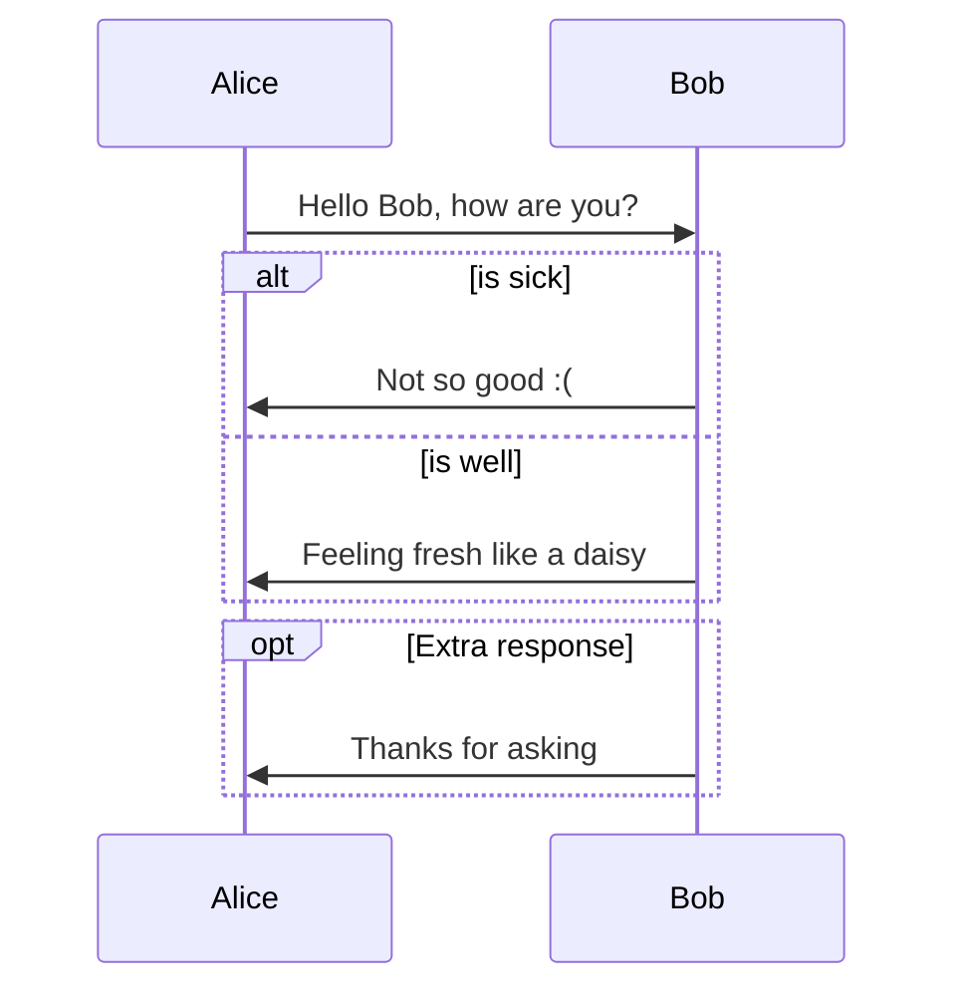
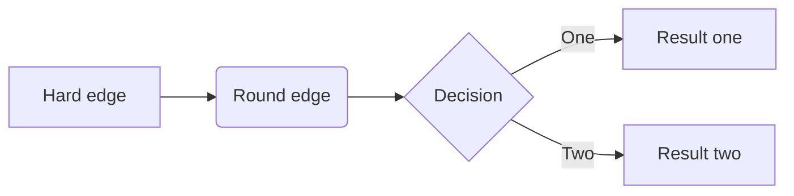
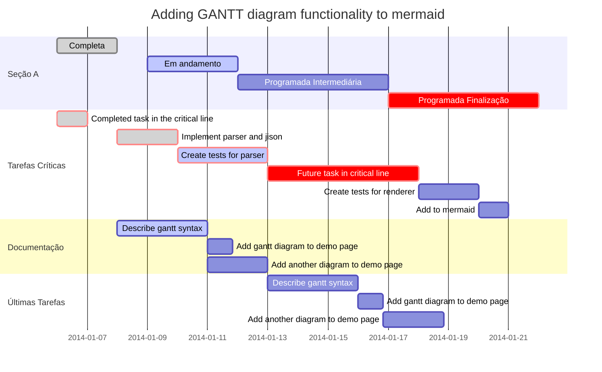
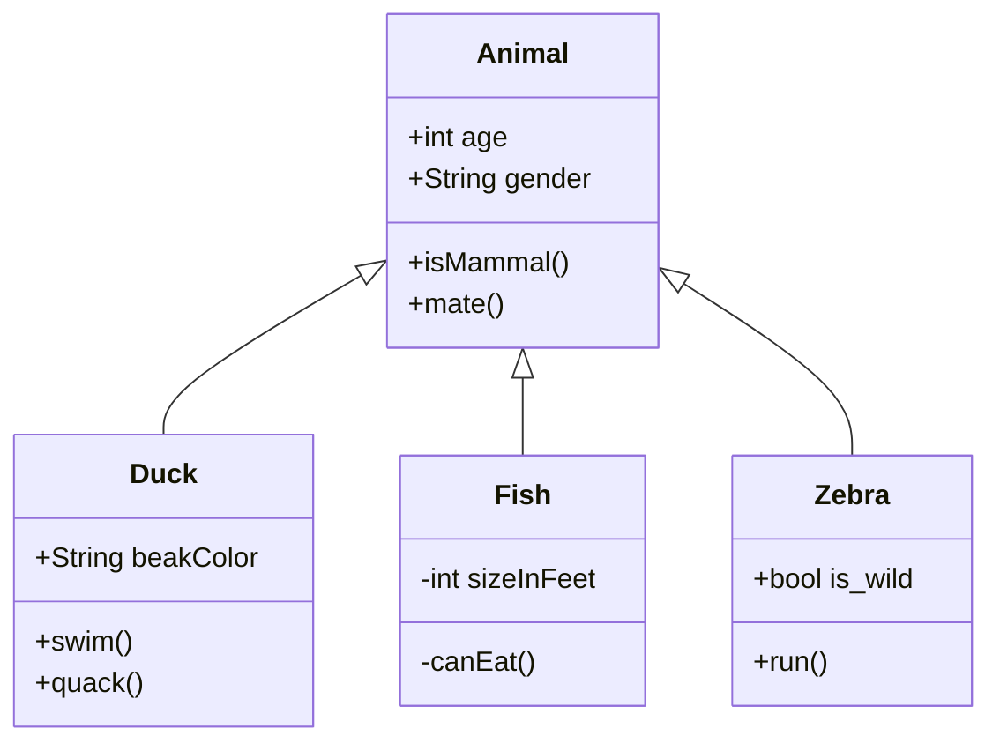
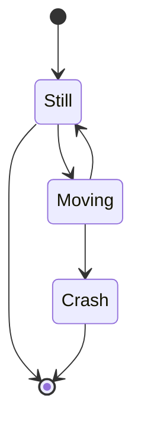
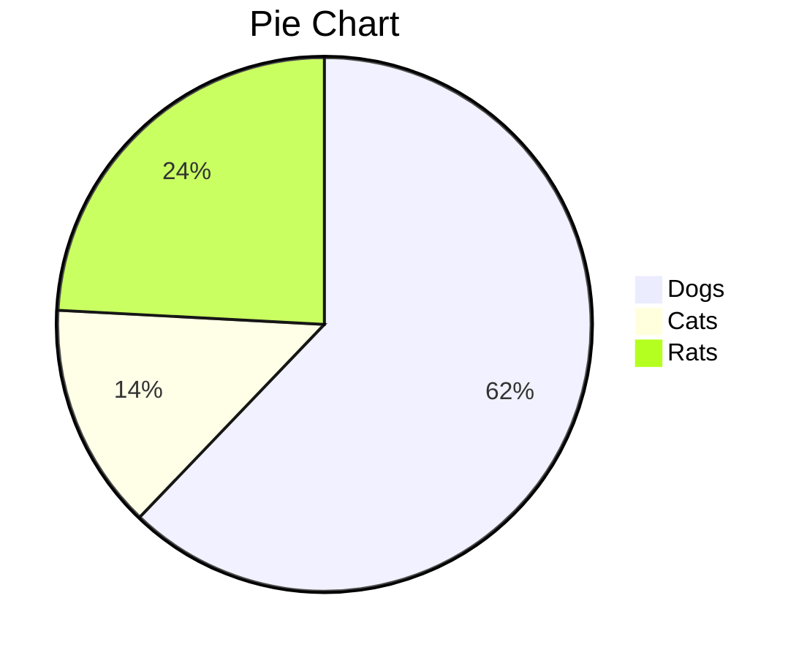

# Mermaid

Para editar este documento MarkDown, utilizei o programa Typora, vesão Linux.  O Typora também tem integração com mermaid, o qual suporta **sequence diagrams**, **flowcharts**, **Gantt charts**, **class state**, **diagrams** e **pie charts**.

## Sequence Diagrams

Para mais detalhes [visite este site](https://mermaid.js.org/syntax/sequenceDiagram.html).

    ```mermaid %% Example of sequence diagram
      sequenceDiagram
        Alice->>Bob: Hello Bob, how are you?
        alt is sick
        Bob->>Alice: Not so good :(
        else is well
        Bob->>Alice: Feeling fresh like a daisy
        end
        opt Extra response
        Bob->>Alice: Thanks for asking
        end
    ```



## Flowcharts

Para mais detalhes [visite este site](https://mermaid.js.org/syntax/flowchart.html).

    ```mermaid
    graph LR
    A[Hard edge] -->B(Round edge)
        B --> C{Decision}
        C -->|One| D[Result one]
        C -->|Two| E[Result two]
    ```



## Gantt Charts

Para mais detalhes [visite este site](https://mermaid.js.org/syntax/gantt.html).

    ```mermaid %% Example with selection of syntaxes
            gantt
            dateFormat  YYYY-MM-DD
            title Adding GANTT diagram functionality to mermaid
    
            section A section
            Completed task            :done,    des1, 2014-01-06,2014-01-08
            Active task               :active,  des2, 2014-01-09, 3d
            Future task               :         des3, after des2, 5d
            Future task2               :         des4, after des3, 5d
    
            section Critical tasks
            Completed task in the critical line :crit, done, 2014-01-06,24h
            Implement parser and jison          :crit, done, after des1, 2d
            Create tests for parser             :crit, active, 3d
            Future task in critical line        :crit, 5d
            Create tests for renderer           :2d
            Add to mermaid                      :1d
    
            section Documentation
            Describe gantt syntax               :active, a1, after des1, 3d
            Add gantt diagram to demo page      :after a1  , 20h
            Add another diagram to demo page    :doc1, after a1  , 48h
    
            section Last section
            Describe gantt syntax               :after doc1, 3d
            Add gantt diagram to demo page      : 20h
            Add another diagram to demo page    : 48h
    ```



## Class Diagrams

Para mais detalhes [visite este site](https://mermaid.js.org/syntax/classDiagram.html).

    ```mermaid
    classDiagram
          Animal <|-- Duck
          Animal <|-- Fish
          Animal <|-- Zebra
          Animal : +int age
          Animal : +String gender
          Animal: +isMammal()
          Animal: +mate()
          class Duck{
              +String beakColor
              +swim()
              +quack()
          }
          class Fish{
              -int sizeInFeet
              -canEat()
          }
          class Zebra{
              +bool is_wild
              +run()
          }
    ```



# State Diagrams

Para mais detalhes [visite este site](https://mermaid.js.org/syntax/stateDiagram.html).

    ```mermaid
    stateDiagram
        [*] --> Still
        Still --> [*]
    
        Still --> Moving
        Moving --> Still
        Moving --> Crash
        Crash --> [*]
    ```



# Pie Charts
Para mais detalhes [visite este site](https://mermaid.js.org/syntax/pie.html)

    ```mermaid
    pie
        title Pie Chart
        "Dogs" : 386
        "Cats" : 85
        "Rats" : 150 
    ```



$$ x = (1,2,3,...,n) $$
$$ soma(x) = \sum_{i=1}^nx_i $$

